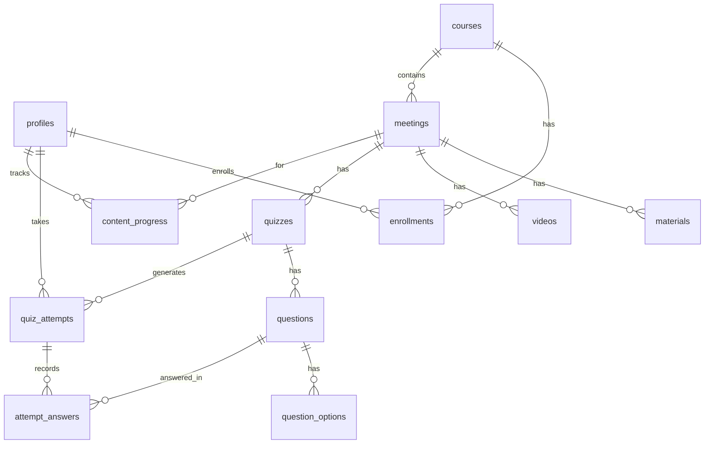

# Product Requirements Document — Kimia Pintar LMS (v2)

**Product:** Kimia Pintar — Chemistry Learning Management System
**Domain:** kimiapintar.com
**Migration:** WordPress LMS → Next.js + Supabase
**Document type:** Technical PRD (developer-focused)
**Version:** 1.0 (Draft)
**Last updated:** 2026-06-24
**Owner:** Machine (Lanius Lab)
**Status:** Draft — pending stakeholder sign-off

---

## 1. Document Control

| Field | Value |
|---|---|
| Document ID | PRD-KIMIAPINTAR-V2-001 |
| Audience | Engineering, BA/PM, stakeholder (Bu Maya) |
| Source of requirements | Client message (Emmil, on behalf of Bu Maya), 2026 |
| Primary stakeholder | Bu Maya (instructor / course owner) |
| Reviewers | Lead Developer, Product Owner |
| Related assets | Video library (Google Drive), legacy WordPress site |

### Revision history

| Version | Date | Author | Notes |
|---|---|---|---|
| 1.0 | 2026-06-24 | Machine | Initial draft from client requirements |

---

## 2. Overview

### 2.1 Background

Kimia Pintar (`kimiapintar.com`) is an existing Learning Management System (LMS) built on WordPress, used by Bu Maya to deliver chemistry courses to her students. The current site is suffering a **critical error that blocks login** and is no longer maintainable ("usang" / outdated). The decision has been made to **rebuild the platform from scratch** on a modern stack (**Next.js + Supabase**) rather than repair the WordPress installation.

The new build must reproduce the **structure and feature set of the previous LMS**: chemistry courses, each containing sequential meetings (*pertemuan*), and each meeting offering learning materials, learning videos, and quizzes with configurable rules.

### 2.2 Problem statement

The legacy WordPress LMS is unreliable (critical login failure), hard to maintain, and outdated. Students cannot access course content. Bu Maya needs a stable, fast, maintainable platform that preserves the existing learning structure and quiz capabilities, and that can scale from one course (Kimia Dasar) to seven.

### 2.3 Product vision

A reliable, fast, mobile-friendly chemistry LMS where students log in to study structured course material, watch lesson videos, and take graded quizzes — and where an admin can manage all course content and review student results without touching code or fighting plugin conflicts.

### 2.4 Goals

1. **Feature parity** with the legacy LMS: courses → meetings → (materials, videos, quizzes).
2. **Reliable authentication** — eliminate the login failure that killed the old site.
3. **Robust quiz engine** — time limits, multiple question types, configurable grading and result display.
4. **Easy content management** — admin can create/edit courses, meetings, materials, videos, and quizzes via UI.
5. **Scalable structure** — ship with 7 course shells; fully populate **Kimia Dasar** first.
6. **Modern, maintainable codebase** — typed, documented, deployable on managed infrastructure.

### 2.5 Non-goals (for v2 MVP)

- Payment / e-commerce / paid enrollment.
- Public marketing site / blog / CMS beyond the LMS itself.
- Native mobile apps (responsive web only).
- Live classes / video conferencing.
- Forums / social features / messaging (candidate for later phase).
- Migrating the WordPress theme or visual design verbatim.
- AI-generated content or auto-grading of free-text essays (manual grading in MVP).

### 2.6 Success metrics

| Metric | Target |
|---|---|
| Login success rate | ≥ 99.5% (no critical login outage) |
| Page load (LCP, course pages) | ≤ 2.5s on 4G |
| Quiz submission reliability | 100% of submitted attempts persisted (no lost answers) |
| Admin content creation | Bu Maya can publish a full meeting (material + video + quiz) without developer help |
| Kimia Dasar completeness | 100% of provided meetings live at launch |
| Uptime | ≥ 99.5% monthly |

---

## 3. Personas & Stakeholders

### 3.1 Student (primary user — e.g., "Emmil")
- University student enrolled in Bu Maya's chemistry course(s).
- Wants to: log in reliably, read materials, watch videos, take quizzes, see scores/results.
- Devices: mostly mobile and laptop browsers, variable network quality.
- Pain point with old site: **cannot log in at all**.

### 3.2 Admin / Instructor (e.g., "Bu Maya")
- Course owner and content author.
- Wants to: create and organize courses and meetings, upload materials, link Google Drive videos, build quizzes, set quiz rules, manage students, and review results/grades.
- Non-technical: needs a clear admin UI, no code, no plugin wrangling.
- In MVP, the **Admin role also performs all instructor/content-management duties** (combined role).

### 3.3 Stakeholder map

| Role | Person | Interest |
|---|---|---|
| Course owner / Admin | Bu Maya | Content, grades, platform stability |
| Liaison | Emmil (student) | Reported the outage; relays requirements |
| Builder | Machine (Lanius Lab) | Designs and develops the new platform |

---

## 4. Scope

### 4.1 In scope (MVP)

- Email/password authentication with secure session handling and password reset.
- Two roles: **Admin** and **Student** (see §6).
- **Course catalog** of 7 chemistry courses (shells created; only Kimia Dasar populated):
  1. Kimia Dasar
  2. Kimia Organik
  3. Kimia Anorganik
  4. Biokimia
  5. Kimia Analitik
  6. Kimia Fisika
  7. Kimia Instrumen
- **Course → Meetings (pertemuan)** structure with ordering.
- **Per-meeting content:** learning materials (rich text + file attachments), learning videos (Google Drive embed), and a quiz.
- **Quiz engine** with: time limit, multiple question types, attempt limits, configurable scoring, and configurable result/answer visibility.
- **Student progress tracking** (per meeting / per content item).
- **Admin content management** (CRUD for courses, meetings, materials, videos, quizzes, questions).
- **Admin student & enrollment management** and **results/gradebook** review.
- Student and admin **dashboards**.
- Responsive UI in **Bahasa Indonesia** (UI copy), built mobile-first.

### 4.2 Out of scope (MVP)

See §2.5. Notable deferrals: certificates, discussion forums, notifications/email reminders beyond auth emails, advanced analytics, SCORM/xAPI, and bulk question import (manual entry in MVP, scripted import optional — see §15).

### 4.3 Assumptions

- UI language is **Bahasa Indonesia**; this PRD is in English for the engineering team.
- Student accounts are **provisioned/invited by the admin** (or self-register then admin-approve) — see Open Questions §18.
- **Google Drive remains the video host** for MVP; videos are shared "anyone with the link can view."
- Single admin/instructor (Bu Maya) at launch; the data model still supports multiple admins.
- The legacy WordPress quiz content will be **re-entered manually** unless DB access enables a scripted import (§15).

---

## 5. Information Architecture

### 5.1 Content hierarchy

```
Course (Mata Kuliah)
└── Meeting (Pertemuan)   [ordered: Pertemuan 1, 2, 3, ...]
    ├── Material(s)       (rich text + optional file attachments)
    ├── Video(s)          (Google Drive embed)
    └── Quiz              (0 or 1 per meeting in MVP; model allows more)
        └── Question(s)
            └── Option(s) / accepted answers
```

### 5.2 Route map (Next.js App Router)

```
Public / Auth
  /                         → redirect to /dashboard or /login
  /login                    → email + password sign-in
  /register                 → (optional) student self-registration
  /forgot-password          → request reset email
  /reset-password           → set new password (token)

Student (authenticated, role: student|admin)
  /dashboard                → enrolled courses, continue-learning, recent results
  /courses                  → course catalog (enrolled + browsable)
  /courses/[courseSlug]     → course overview + meeting list
  /courses/[courseSlug]/[meetingSlug]
                            → meeting page: materials, videos, quiz entry
  /quiz/[quizId]            → quiz intro/rules screen
  /quiz/[quizId]/attempt/[attemptId]
                            → quiz player (timer, questions, navigation)
  /quiz/[quizId]/result/[attemptId]
                            → attempt result + review (per quiz policy)
  /me/results              → student's own grades across courses
  /me/profile              → profile & password

Admin (authenticated, role: admin)
  /admin                    → admin dashboard (counts, recent activity)
  /admin/courses            → list/create courses
  /admin/courses/[id]       → edit course; manage meetings
  /admin/courses/[id]/meetings/[meetingId]
                            → edit meeting; manage materials, videos, quiz
  /admin/quizzes/[quizId]   → quiz settings + question builder
  /admin/students           → student list, invite, enroll, deactivate
  /admin/enrollments        → enroll students into courses
  /admin/gradebook          → results across courses/quizzes; export CSV
  /admin/settings           → platform settings
```

---

## 6. Roles & Permissions

Two application roles in MVP: **`admin`** and **`student`**. Role is stored on the user profile and enforced by Supabase Row Level Security (RLS) + route guards.

| Capability | Student | Admin |
|---|:---:|:---:|
| Sign in / manage own profile | ✅ | ✅ |
| View published courses they are enrolled in | ✅ | ✅ (all) |
| View materials & videos | ✅ (enrolled) | ✅ (all) |
| Take quizzes / submit attempts | ✅ | ✅ (preview) |
| View own results | ✅ | ✅ |
| Create/edit/delete courses, meetings, materials, videos | ❌ | ✅ |
| Create/edit/delete quizzes & questions | ❌ | ✅ |
| Manage students & enrollments | ❌ | ✅ |
| View all students' results / gradebook | ❌ | ✅ |
| Manually grade essay/short-answer questions | ❌ | ✅ |
| Platform settings | ❌ | ✅ |

> **Security note:** correct-answer data (`question_options.is_correct`, accepted short answers) must **never** be sent to a student's browser. Questions are delivered to students through a server-side endpoint/RPC that strips answer keys; grading happens server-side (see §10 and §12.3).

---

## 7. Functional Requirements

Each requirement has an ID (`FR-x`), a priority (**P0** = MVP must-have, **P1** = should-have, **P2** = later), and acceptance criteria (AC).

### 7.1 Authentication & Accounts

**FR-1 (P0) — Email/password sign-in.**
Users sign in with email + password using Supabase Auth (`@supabase/ssr`, cookie-based sessions).
- AC1: Valid credentials create a session and redirect to `/dashboard` (student) or `/admin` (admin).
- AC2: Invalid credentials show a clear error without revealing which field was wrong.
- AC3: Sessions persist across reloads and are refreshed server-side; expired sessions redirect to `/login`.
- AC4: The legacy critical-login failure mode does not recur — login is covered by automated tests and an uptime check.

**FR-2 (P0) — Password reset.** Self-service "forgot password" via email magic-link/OTP → set new password.
- AC1: Submitting a registered email sends a reset link; unregistered emails return the same neutral confirmation (no account enumeration).
- AC2: Reset link is single-use and time-limited.

**FR-3 (P0) — Role-based access.** Each account is `admin` or `student`; UI and data access reflect role.
- AC1: A student visiting any `/admin/*` route is redirected/403.
- AC2: Role is read from the `profiles` table, not from client-editable state.

**FR-4 (P1) — Account provisioning.** Admin can invite/create student accounts and (optionally) students can self-register.
- AC1: Admin can create a student (email, name, NIM) and trigger an invite email.
- AC2: If self-registration is enabled, new sign-ups default to `student` role and `active` status.

**FR-5 (P1) — Profile management.** Users edit display name, photo (optional), and change password.

### 7.2 Course Catalog

**FR-6 (P0) — Seven course shells.** The catalog contains the 7 named chemistry courses; each can be published/unpublished.
- AC1: All 7 courses exist as records with title, code, slug, description, cover image, and color.
- AC2: Unpublished/empty courses are visibly marked "Segera hadir / Coming soon" and are not enterable by students.

**FR-7 (P0) — Kimia Dasar populated.** Kimia Dasar is fully built out with its meetings, materials, videos, and quizzes at launch.

**FR-8 (P0) — Course overview page.** Shows description and an ordered list of meetings with per-meeting status (locked/available/completed) and progress.

### 7.3 Meetings (Pertemuan)

**FR-9 (P0) — Ordered meetings.** A course contains multiple meetings rendered in explicit order (Pertemuan 1, 2, 3…).
- AC1: Admin sets/Reorders sequence; students see them in order.
- AC2: Each meeting has a title, optional description, and publish state.

**FR-10 (P1) — Sequential unlock (optional).** Admin can optionally require completing a meeting (or its quiz) before the next unlocks.
- AC1: Setting is per-course; default = all unlocked.

### 7.4 Learning Materials

**FR-11 (P0) — Rich-text material.** Each meeting can have one or more material blocks with formatted text (headings, lists, bold/italic, images, equations).
- AC1: Admin authors material in a rich-text/Markdown editor; chemistry formulas render (subscripts/superscripts; LaTeX support is P1).
- AC2: Material renders responsively and is readable on mobile.

**FR-12 (P0) — File attachments.** Materials can include downloadable files (PDF, slides, images) stored in Supabase Storage.
- AC1: Admin uploads a file; students can download it.
- AC2: Files inherit access control (only enrolled students / admin).

### 7.5 Learning Videos

**FR-13 (P0) — Google Drive video embed.** Each meeting can have one or more videos hosted on Google Drive, embedded inline.
- AC1: Admin pastes a Google Drive share link or file ID; the system stores the file ID and renders the player via `https://drive.google.com/file/d/<FILE_ID>/preview` in a responsive 16:9 iframe.
- AC2: Videos play inline without leaving the page; on mobile the player is full-width.
- AC3: If a video is unavailable (permissions/removed), the UI shows a friendly fallback and a "open in Drive" link.
- Reference video library: `https://drive.google.com/drive/folders/19fzYn5RpeR0YcExt1-896J92AuN2rjvU`.
- **Constraint:** Drive videos must be shared "Anyone with the link – Viewer." Drive provides no granular watch analytics; migrating to a dedicated host (Mux/Cloudflare Stream/YouTube unlisted) is a P2 option.

### 7.6 Quizzes — see dedicated spec in §8.

**FR-14 (P0) — Quiz per meeting.** A meeting can have a quiz with configurable rules and varied question types.
**FR-15 (P0) — Time limit.** Quizzes support an optional countdown; auto-submit on expiry.
**FR-16 (P0) — Multiple question types.** At minimum: single-choice, multiple-choice, true/false (MVP). Short-answer, essay, matching (P1).
**FR-17 (P0) — Scoring & result settings.** Configurable points, passing score, attempt limits, grading method, and answer-visibility policy.
**FR-18 (P0) — Attempts & results.** Students start, answer, submit, and view results per the quiz's visibility policy; attempts are persisted server-side.

### 7.7 Progress & Results

**FR-19 (P1) — Content progress.** Track which materials/videos a student has completed and overall meeting/course progress %.
**FR-20 (P0) — Student results view.** Students see their quiz scores and (per policy) review answers.
**FR-21 (P0) — Admin gradebook.** Admin sees all students' attempts/scores per quiz/course and can export CSV.

### 7.8 Admin Management

**FR-22 (P0) — Content CRUD.** Admin can create, edit, reorder, publish/unpublish, and delete courses, meetings, materials, videos, quizzes, and questions.
**FR-23 (P0) — Student & enrollment management.** Admin can list students, invite/create, enroll/un-enroll into courses, and deactivate accounts.
**FR-24 (P1) — Manual grading.** Admin grades essay/short-answer responses and the attempt score updates.
**FR-25 (P2) — Platform settings.** Site name, default policies, registration on/off.

---

## 8. Quiz Engine — Detailed Specification

This is the most rules-heavy module and the core of "same settings as the previous LMS" (time limits, varied question types, score/result settings).

### 8.1 Quiz-level settings

| Setting | Type | Default | Notes |
|---|---|---|---|
| `title`, `description` | text | — | Shown on intro screen |
| `time_limit_minutes` | int, nullable | null (no limit) | Countdown; auto-submit at 0 |
| `max_attempts` | int, nullable | 1 | null = unlimited |
| `passing_score` | numeric (%) | 60 | Pass/fail threshold |
| `grading_method` | enum | `highest` | `highest` \| `latest` \| `average` \| `first` — which attempt counts |
| `shuffle_questions` | bool | false | Randomize question order per attempt |
| `shuffle_options` | bool | false | Randomize option order |
| `show_correct_answers` | enum | `after_submit` | `never` \| `after_submit` \| `after_close` |
| `show_score_immediately` | bool | true | Reveal score right after submit (auto-graded portion) |
| `available_from` / `available_until` | timestamptz, nullable | null | Open/close window |
| `questions_per_page` | int | 1 | 1 = one-by-one; 0 = all on one page |
| `allow_backtrack` | bool | true | Can revisit previous questions |
| `is_published` | bool | false | Draft vs live |

### 8.2 Question types

| Type | Auto-graded | Description |
|---|:---:|---|
| `single_choice` | ✅ | One correct option (radio) |
| `multiple_choice` | ✅ | Multiple correct options (checkbox); scoring all-or-nothing or partial (configurable) |
| `true_false` | ✅ | Boolean |
| `short_answer` | ✅ | Text matched against accepted answers (case/space-normalized; P1) |
| `fill_blank` | ✅ | One or more blanks with accepted answers (P1) |
| `matching` | ✅ | Pair left items to right items (P1) |
| `ordering` | ✅ | Arrange items in correct sequence (P2) |
| `essay` | ❌ (manual) | Free text, graded by admin (P1) |

Per-question fields: `prompt` (rich text), `points`, `explanation` (shown on review), `sort_order`, and `metadata` (jsonb) for type-specific config (e.g., partial-credit flag, blanks, matching pairs).

### 8.3 Attempt lifecycle

```
[start] → in_progress → (submit | time-expiry) → submitted
        → auto-grade objective questions → graded (if no manual items)
        → if essay/short-answer needs review → awaiting_manual_grade → graded
```

- AC1: Starting an attempt creates a `quiz_attempts` row with `started_at`; the server is the source of truth for the deadline (`started_at + time_limit`).
- AC2: Answers autosave as the student progresses (resilient to refresh/disconnect).
- AC3: On submit or server-side deadline, the attempt is finalized; late client submissions past the server deadline are rejected/auto-submitted.
- AC4: `max_attempts` is enforced server-side; the "Start" button is disabled when exhausted.
- AC5: Final recorded grade follows `grading_method`.

### 8.4 Scoring rules

- Objective questions graded server-side immediately on submit.
- Multiple-choice partial credit: configurable per question (`metadata.partial_credit`); default all-or-nothing.
- `percentage = points_awarded / max_score * 100`; pass if `percentage ≥ passing_score`.
- Attempts containing essay/short-answer remain `awaiting_manual_grade` until the admin grades them; the score then recomputes.

### 8.5 Result & review visibility

- `never`: student sees score only (if `show_score_immediately`), never the correct answers.
- `after_submit`: correct answers + explanations shown on the result page immediately.
- `after_close`: answers revealed only after `available_until` passes.
- AC: The review screen renders the student's answer, correctness, the correct answer, and `explanation`, strictly per policy and only for the attempt's owner (or admin).

### 8.6 Anti-cheat (baseline, MVP)

- Server-authoritative timer and grading; never trust client.
- Shuffle questions/options; optional question pools (P2).
- Answer keys never delivered to the client before allowed.
- Rate-limit attempt start/submit endpoints.
- (P2) tab-blur logging, single-active-attempt lock, randomized subsets.

---

## 9. Data Model (Supabase / PostgreSQL)

### 9.1 Entity-relationship overview



### 9.2 Enumerated types

```sql
create type user_role         as enum ('admin', 'student');
create type enrollment_status as enum ('active', 'completed', 'dropped');
create type question_type     as enum (
  'single_choice','multiple_choice','true_false',
  'short_answer','fill_blank','matching','ordering','essay'
);
create type attempt_status    as enum (
  'in_progress','submitted','awaiting_manual_grade','graded','expired'
);
create type answers_policy    as enum ('never','after_submit','after_close');
create type grading_method    as enum ('highest','latest','average','first');
create type content_item_type as enum ('material','video');
```

### 9.3 Tables

> All tables use `id uuid primary key default gen_random_uuid()`, `created_at timestamptz default now()`, and (where edited) `updated_at timestamptz default now()` maintained by a trigger.

**`profiles`** — 1:1 with `auth.users`.
```sql
create table profiles (
  id           uuid primary key references auth.users(id) on delete cascade,
  role         user_role not null default 'student',
  full_name    text not null,
  student_no   text,                -- NIM (nullable for admins)
  avatar_url   text,
  is_active    boolean not null default true,
  created_at   timestamptz not null default now(),
  updated_at   timestamptz not null default now()
);
```

**`courses`**
```sql
create table courses (
  id            uuid primary key default gen_random_uuid(),
  code          text unique not null,        -- e.g. 'KIMIA-DASAR'
  slug          text unique not null,         -- e.g. 'kimia-dasar'
  title         text not null,
  description   text,
  cover_image_url text,
  color         text,                         -- theme accent
  sort_order    int not null default 0,
  is_published  boolean not null default false,
  created_by    uuid references profiles(id),
  created_at    timestamptz not null default now(),
  updated_at    timestamptz not null default now()
);
```

**`enrollments`**
```sql
create table enrollments (
  id          uuid primary key default gen_random_uuid(),
  course_id   uuid not null references courses(id) on delete cascade,
  student_id  uuid not null references profiles(id) on delete cascade,
  status      enrollment_status not null default 'active',
  enrolled_at timestamptz not null default now(),
  unique (course_id, student_id)
);
```

**`meetings`** (pertemuan)
```sql
create table meetings (
  id           uuid primary key default gen_random_uuid(),
  course_id    uuid not null references courses(id) on delete cascade,
  title        text not null,                 -- e.g. 'Pertemuan 1: Stoikiometri'
  slug         text not null,
  description  text,
  sort_order   int not null default 0,        -- sequence within course
  is_published boolean not null default false,
  created_at   timestamptz not null default now(),
  updated_at   timestamptz not null default now(),
  unique (course_id, slug)
);
```

**`materials`**
```sql
create table materials (
  id            uuid primary key default gen_random_uuid(),
  meeting_id    uuid not null references meetings(id) on delete cascade,
  title         text not null,
  body          text,                          -- HTML/Markdown rich text
  attachment_url text,                          -- Supabase Storage path
  sort_order    int not null default 0,
  is_published  boolean not null default true,
  created_at    timestamptz not null default now(),
  updated_at    timestamptz not null default now()
);
```

**`videos`**
```sql
create table videos (
  id             uuid primary key default gen_random_uuid(),
  meeting_id     uuid not null references meetings(id) on delete cascade,
  title          text not null,
  provider       text not null default 'google_drive',  -- 'google_drive'|'youtube'
  drive_file_id  text,                                   -- extracted file ID
  source_url     text,                                   -- original share URL
  duration_seconds int,
  sort_order     int not null default 0,
  is_published   boolean not null default true,
  created_at     timestamptz not null default now()
);
```

**`quizzes`**
```sql
create table quizzes (
  id                  uuid primary key default gen_random_uuid(),
  meeting_id          uuid references meetings(id) on delete cascade,
  course_id           uuid references courses(id) on delete cascade, -- denormalized for RLS/queries
  title               text not null,
  description         text,
  time_limit_minutes  int,                       -- null = no limit
  max_attempts        int default 1,             -- null = unlimited
  passing_score       numeric(5,2) not null default 60,
  grading_method      grading_method not null default 'highest',
  shuffle_questions   boolean not null default false,
  shuffle_options     boolean not null default false,
  show_correct_answers answers_policy not null default 'after_submit',
  show_score_immediately boolean not null default true,
  questions_per_page  int not null default 1,
  allow_backtrack     boolean not null default true,
  available_from      timestamptz,
  available_until     timestamptz,
  is_published        boolean not null default false,
  created_at          timestamptz not null default now(),
  updated_at          timestamptz not null default now()
);
```

**`questions`**
```sql
create table questions (
  id          uuid primary key default gen_random_uuid(),
  quiz_id     uuid not null references quizzes(id) on delete cascade,
  type        question_type not null,
  prompt      text not null,                 -- rich text
  points      numeric(6,2) not null default 1,
  explanation text,                           -- shown on review
  sort_order  int not null default 0,
  metadata    jsonb not null default '{}',    -- type-specific config
  created_at  timestamptz not null default now(),
  updated_at  timestamptz not null default now()
);
```

**`question_options`** — choices and answer keys (NEVER exposed to students raw).
```sql
create table question_options (
  id           uuid primary key default gen_random_uuid(),
  question_id  uuid not null references questions(id) on delete cascade,
  content      text not null,
  is_correct   boolean not null default false,
  match_key    text,                          -- for matching pairs
  feedback     text,
  sort_order   int not null default 0
);
```

**`quiz_attempts`**
```sql
create table quiz_attempts (
  id             uuid primary key default gen_random_uuid(),
  quiz_id        uuid not null references quizzes(id) on delete cascade,
  student_id     uuid not null references profiles(id) on delete cascade,
  attempt_number int not null default 1,
  status         attempt_status not null default 'in_progress',
  started_at     timestamptz not null default now(),
  deadline_at    timestamptz,                 -- started_at + time_limit (server-set)
  submitted_at   timestamptz,
  score          numeric(7,2),
  max_score      numeric(7,2),
  percentage     numeric(5,2),
  passed         boolean,
  time_spent_seconds int,
  graded_by      uuid references profiles(id),
  graded_at      timestamptz,
  unique (quiz_id, student_id, attempt_number)
);
```

**`attempt_answers`**
```sql
create table attempt_answers (
  id                 uuid primary key default gen_random_uuid(),
  attempt_id         uuid not null references quiz_attempts(id) on delete cascade,
  question_id        uuid not null references questions(id) on delete cascade,
  selected_option_ids uuid[] default '{}',     -- for choice types
  answer_text        text,                       -- short_answer/essay/fill_blank
  answer_json        jsonb,                      -- matching/ordering payloads
  is_correct         boolean,                    -- null until graded
  points_awarded     numeric(6,2) default 0,
  feedback           text,                       -- manual grading note
  answered_at        timestamptz not null default now(),
  unique (attempt_id, question_id)
);
```

**`content_progress`**
```sql
create table content_progress (
  id           uuid primary key default gen_random_uuid(),
  student_id   uuid not null references profiles(id) on delete cascade,
  meeting_id   uuid not null references meetings(id) on delete cascade,
  item_type    content_item_type not null,
  item_id      uuid not null,                  -- material_id or video_id
  completed    boolean not null default false,
  completed_at timestamptz,
  unique (student_id, item_type, item_id)
);
```

### 9.4 Indexes (selected)

```sql
create index on meetings (course_id, sort_order);
create index on materials (meeting_id, sort_order);
create index on videos (meeting_id, sort_order);
create index on questions (quiz_id, sort_order);
create index on question_options (question_id, sort_order);
create index on quiz_attempts (student_id, quiz_id);
create index on attempt_answers (attempt_id);
create index on enrollments (student_id);
create index on content_progress (student_id, meeting_id);
```

---

## 10. Security & Row-Level Security (RLS)

RLS is enabled on **all** application tables. A helper inspects the caller's role.

```sql
-- helper: is the current user an admin?
create or replace function is_admin() returns boolean
language sql stable security definer set search_path = public as $$
  select exists (
    select 1 from profiles
    where id = auth.uid() and role = 'admin' and is_active
  );
$$;
```

**Representative policies:**

```sql
-- profiles: self read/update; admins read all
alter table profiles enable row level security;
create policy "profiles_self_read"   on profiles for select using (id = auth.uid() or is_admin());
create policy "profiles_self_update" on profiles for update using (id = auth.uid()) with check (id = auth.uid());
create policy "profiles_admin_all"   on profiles for all using (is_admin()) with check (is_admin());

-- courses: students read published; admins all
alter table courses enable row level security;
create policy "courses_read_published" on courses for select
  using (is_published or is_admin());
create policy "courses_admin_write"    on courses for all
  using (is_admin()) with check (is_admin());

-- meetings/materials/videos: enrolled students read published rows of their course
alter table meetings enable row level security;
create policy "meetings_read" on meetings for select using (
  is_admin() or (
    is_published and exists (
      select 1 from enrollments e
      where e.student_id = auth.uid() and e.course_id = meetings.course_id
        and e.status = 'active'
    )
  )
);
create policy "meetings_admin_write" on meetings for all using (is_admin()) with check (is_admin());
-- (materials & videos mirror this via their meeting's course enrollment)

-- quizzes: enrolled students read published; admins all
alter table quizzes enable row level security;
create policy "quizzes_read" on quizzes for select using (
  is_admin() or (
    is_published and exists (
      select 1 from enrollments e
      where e.student_id = auth.uid() and e.course_id = quizzes.course_id
        and e.status = 'active'
    )
  )
);
create policy "quizzes_admin_write" on quizzes for all using (is_admin()) with check (is_admin());

-- questions: readable to eligible users WITHOUT answer keys (see note)
-- question_options: ADMIN ONLY direct access; answer keys never exposed via PostgREST
alter table question_options enable row level security;
create policy "options_admin_only" on question_options for all
  using (is_admin()) with check (is_admin());

-- quiz_attempts & attempt_answers: students own theirs; admins read all
alter table quiz_attempts enable row level security;
create policy "attempts_owner" on quiz_attempts for select
  using (student_id = auth.uid() or is_admin());
create policy "attempts_insert_self" on quiz_attempts for insert
  with check (student_id = auth.uid());
create policy "attempts_admin_update" on quiz_attempts for update using (is_admin());

alter table attempt_answers enable row level security;
create policy "answers_owner" on attempt_answers for all using (
  exists (select 1 from quiz_attempts a
          where a.id = attempt_answers.attempt_id
            and (a.student_id = auth.uid() or is_admin()))
);

-- content_progress: students own; admins read
alter table content_progress enable row level security;
create policy "progress_owner" on content_progress for all
  using (student_id = auth.uid() or is_admin())
  with check (student_id = auth.uid() or is_admin());
```

**Answer-key protection.** Student clients do **not** read `question_options` directly. Quiz delivery and grading go through `SECURITY DEFINER` RPCs / server routes that (a) return questions and options *without* `is_correct`, and (b) compute scores on the server. This prevents leaking answers through the auto-generated PostgREST API even if a student inspects network traffic.

---

## 11. Storage

| Bucket | Access | Contents |
|---|---|---|
| `course-covers` | public read | Course cover images |
| `materials` | authenticated, RLS-guarded via signed URLs | Material attachments (PDF/slides/images) |
| `avatars` | owner read/write | Profile photos |

- Material/attachment downloads use **short-lived signed URLs** issued by the server only to enrolled students/admins.
- Videos are **not** stored in Supabase Storage in MVP — they live in Google Drive (see FR-13).

---

## 12. Application Architecture

### 12.1 Tech stack

| Layer | Choice | Notes |
|---|---|---|
| Framework | **Next.js 16** (App Router, Server Components, Server Actions), React 19 | Current stable; Turbopack default |
| Language | TypeScript (strict) | End-to-end types |
| Backend/DB | **Supabase** — Postgres, Auth, Storage, RLS | Managed Postgres + auth |
| Auth | **`@supabase/ssr`** (cookie-based SSR sessions) | `@supabase/auth-helpers-*` is deprecated — do not use |
| Styling | Tailwind CSS + shadcn/ui | Accessible component primitives |
| Forms/validation | React Hook Form + Zod | Shared client/server schemas |
| Rich text | TipTap (author) → sanitized HTML; KaTeX for formulas (P1) | Chemistry notation |
| Data fetching | Server Components + Server Actions; TanStack Query for interactive client views (quiz player) | |
| Testing | Vitest (unit), Playwright (E2E incl. login & quiz flows) | Login is a P0 regression target |
| Hosting | Vercel (web) + Supabase Cloud (DB/auth/storage) | |
| Observability | Vercel Analytics + Sentry; uptime monitor on `/login` | Catch login regressions |

### 12.2 Rendering & data-access pattern

- Public/marketing and course/meeting pages: **Server Components** read via a server Supabase client (RLS-scoped to the user).
- Mutations (admin CRUD, enroll, start/submit quiz): **Server Actions** or Route Handlers with server-side validation (Zod) and RLS.
- Quiz player: client component with autosave to a Route Handler; **server owns the timer and grading**.
- Never expose the Supabase service-role key to the client; admin-only privileged operations run server-side.

### 12.3 Key server endpoints / RPCs

| Operation | Type | Auth | Behavior |
|---|---|---|---|
| `GET /api/quizzes/:id/start` | Route Handler / RPC | student | Validates attempts left & window; creates attempt; sets `deadline_at`; returns sanitized questions (no keys) |
| `POST /api/attempts/:id/answer` | Route Handler | owner | Autosaves a single answer; rejects if past `deadline_at` |
| `POST /api/attempts/:id/submit` | Route Handler / RPC | owner | Finalizes, auto-grades objective items, sets status/score |
| `POST /api/attempts/:id/grade` | Route Handler | admin | Manual grade for essay/short-answer; recomputes score |
| `grade_attempt(attempt_id)` | SECURITY DEFINER fn | server | Server-side scoring using answer keys |
| `enroll_student(course_id, student_id)` | Route Handler | admin | Creates enrollment |

---

## 13. Non-Functional Requirements

| Category | Requirement |
|---|---|
| **Performance** | LCP ≤ 2.5s on 4G for course/meeting pages; quiz autosave round-trip < 500ms typical. |
| **Reliability** | ≥ 99.5% uptime; zero data loss on submitted quiz attempts; daily DB backups (Supabase PITR). |
| **Security** | RLS on all tables; answer keys never client-exposed; OWASP Top-10 hygiene; signed URLs for files; service-role key server-only; rate limiting on auth & quiz endpoints. |
| **Privacy** | Store only necessary student data (name, email, NIM); comply with applicable data-protection norms; deletable accounts. |
| **Accessibility** | Target WCAG 2.1 AA — keyboard navigable, sufficient contrast, labeled controls, focus states. |
| **Responsive** | Mobile-first; usable from ~360px width up; video player and quiz usable on phones. |
| **i18n** | UI copy in Bahasa Indonesia; code/comments in English; structure allows future locale addition. |
| **Browser support** | Latest 2 versions of Chrome, Safari, Edge, Firefox; iOS/Android mobile browsers. |
| **Maintainability** | Typed, linted, documented; seed scripts; migrations version-controlled. |
| **Observability** | Error tracking (Sentry), uptime check on `/login`, structured logs for quiz submit/grade. |

---

## 14. Analytics & Reporting

- **Admin gradebook:** per course → per quiz → per student attempts, scores, pass/fail; CSV export.
- **Per-student view:** all scores across enrolled courses.
- **Course progress:** % of meetings/content completed per student (P1).
- **Quiz item stats (P2):** per-question difficulty/accuracy to spot weak topics.

---

## 15. Migration Plan (WordPress → Next.js + Supabase)

The legacy plugin is **unknown** (LearnDash / Tutor LMS / LearnPress / other). Plan accommodates either scripted import (if DB access exists) or manual re-entry.

### 15.1 Discovery
1. Obtain a copy of the WordPress MySQL DB and `wp-content/uploads` (if site is recoverable read-only).
2. Identify the LMS plugin and where it stores courses/lessons/quizzes/questions (typically `wp_posts` + `wp_postmeta`, plus plugin-specific tables).
3. Inventory: courses, meetings/lessons, materials, quiz questions, and existing user accounts.

### 15.2 Content migration
- **Materials/text:** export post content → clean HTML → import into `materials.body`.
- **Files:** download from `uploads/` → upload to Supabase Storage `materials` bucket → set `attachment_url`.
- **Videos:** already in Google Drive; record file IDs in `videos`.
- **Quizzes/questions:** if plugin export (CSV/XML) is available, transform → seed `quizzes`/`questions`/`question_options`; otherwise **re-enter via admin UI** (MVP assumption). Kimia Dasar is the priority.

### 15.3 User migration
- Export `wp_users` (email, display name). Recreate as Supabase Auth users (admin-invited) → `profiles` with role/NIM.
- **Do not** migrate WordPress password hashes; force a password reset/invite (also resolves the legacy login defect cleanly).
- Map who is admin (Bu Maya) vs student.

### 15.4 Cutover
1. Build & QA on a staging subdomain (e.g., `app.kimiapintar.com` or `staging.`).
2. Seed 7 course shells; fully populate Kimia Dasar; smoke-test login + quiz end-to-end (Playwright).
3. Soft launch to a small student group; verify login reliability.
4. Point `kimiapintar.com` DNS to the new app; archive the WordPress instance read-only.
5. Add redirects for old URLs where feasible; monitor errors/uptime for the first weeks.

### 15.5 Rollback
- Keep the WordPress archive and a DB snapshot until the new platform is proven stable (≥ 2 weeks post-cutover). Cutover is DNS-level and reversible.

---

## 16. Phasing / Roadmap

**Phase 0 — Foundation (setup).** Repo, Next.js 16 + Supabase project, auth (`@supabase/ssr`), schema + RLS migrations, CI, design system, seed of 7 course shells.

**Phase 1 — MVP (launch).**
- Auth (login, reset, role guard) + admin/student dashboards.
- Course catalog (7 shells) + Kimia Dasar fully populated.
- Meetings, materials (rich text + attachments), Google Drive video embeds.
- Quiz engine core: single-choice, multiple-choice, true/false; time limit; attempts; auto-grading; result/answer policy.
- Student results + admin gradebook (CSV export).
- Admin content CRUD + student/enrollment management.
- Bahasa Indonesia UI, responsive, accessibility pass, E2E tests for login + quiz.

**Phase 2 — Enhancements.**
- More question types: short-answer, fill-in-blank, matching; essay with manual grading.
- KaTeX chemistry/math rendering; sequential unlock; content progress %.
- Populate remaining courses (Organik, Anorganik, Biokimia, Analitik, Fisika, Instrumen).
- Quiz item analytics; question import tooling.

**Phase 3 — Optional.**
- Certificates, notifications/reminders, discussion/Q&A, dedicated video hosting, advanced anti-cheat, mobile PWA.

---

## 17. Risks & Mitigations

| Risk | Impact | Likelihood | Mitigation |
|---|---|---|---|
| Google Drive video unreliable / permissions break | Students can't watch | Med | Fallback UI + "open in Drive"; plan P2 move to dedicated host; document share-setting SOP |
| Unknown legacy plugin → hard data export | Migration effort | Med | Manual re-entry path for MVP; prioritize Kimia Dasar; scripted import only if DB accessible |
| Quiz answer-key leakage | Cheating / integrity | Low | Server-side delivery & grading; RLS lock on options; no keys client-side |
| Scope creep across 7 courses | Delays launch | High | MVP = Kimia Dasar only; others are shells; phase the rest |
| Repeat of login outage | Total block | Low | Managed Supabase Auth, E2E login tests, uptime monitor, no custom password handling |
| Student data loss on disconnect during quiz | Lost work / trust | Med | Per-answer autosave; server-authoritative attempt state |
| Single admin bottleneck (content authoring) | Slow content | Med | Simple admin UX; bulk-friendly editors; multi-admin supported by data model |

---

## 18. Open Questions

1. **Registration model:** Do students self-register, or does the admin invite/provision all accounts? (Affects FR-4.)
2. **Legacy plugin:** Which WordPress LMS plugin was used, and is the database/site still accessible for export?
3. **Quiz grading:** Are free-text/essay questions needed at launch (manual grading), or are objective types sufficient for MVP?
4. **Certificates:** Are completion certificates expected (later phase)?
5. **Enrollment scope:** Are all students enrolled in all courses, or per-course enrollment? (Model supports per-course.)
6. **Concurrency:** Expected number of students and peak concurrent quiz-takers (sizing/rate limits)?
7. **Data retention:** How long to keep attempt history / archived WordPress data?

> Defaults assumed until answered: admin-provisioned accounts; objective question types in MVP with essay in Phase 2; per-course enrollment; no certificates in MVP.

---

## 19. Acceptance / Definition of Done (MVP)

- [ ] A student can register/be invited, log in reliably, and reset a password.
- [ ] The catalog shows all 7 courses; 6 are clearly "coming soon"; Kimia Dasar is fully populated.
- [ ] A student can open a Kimia Dasar meeting and read materials, download attachments, and watch the Google Drive video inline.
- [ ] A student can take a quiz with a time limit and mixed objective question types, submit, and see results per the configured policy.
- [ ] Quiz attempts and answers persist server-side; the timer is server-authoritative; attempt limits are enforced.
- [ ] An admin can create/edit/reorder/publish courses, meetings, materials, videos, quizzes, and questions through the UI.
- [ ] An admin can manage students and enrollments and view/export a gradebook.
- [ ] RLS prevents cross-user data access; answer keys are never sent to student clients.
- [ ] UI is in Bahasa Indonesia, responsive, and passes a WCAG 2.1 AA spot-check.
- [ ] E2E tests cover login and the full quiz flow; uptime monitor is live on `/login`.

---

## 20. Appendix

### 20.1 Seed data — the 7 courses

| # | Code | Title | Launch state |
|---|---|---|---|
| 1 | KIMIA-DASAR | Kimia Dasar | **Fully populated** |
| 2 | KIMIA-ORGANIK | Kimia Organik | Shell (coming soon) |
| 3 | KIMIA-ANORGANIK | Kimia Anorganik | Shell |
| 4 | BIOKIMIA | Biokimia | Shell |
| 5 | KIMIA-ANALITIK | Kimia Analitik | Shell |
| 6 | KIMIA-FISIKA | Kimia Fisika | Shell |
| 7 | KIMIA-INSTRUMEN | Kimia Instrumen | Shell |

### 20.2 Example — question `metadata` (jsonb)

```jsonc
// multiple_choice with partial credit
{ "partial_credit": true }

// fill_blank
{ "blanks": [ { "id": "b1", "accepted": ["H2O", "air"] } ], "case_sensitive": false }

// matching
{ "pairs": [ { "left": "Na", "right": "Natrium" }, { "left": "K", "right": "Kalium" } ] }
```

### 20.3 Example — sanitized quiz payload sent to a student (no answer keys)

```jsonc
{
  "attemptId": "…",
  "deadlineAt": "2026-06-24T08:30:00Z",
  "questionsPerPage": 1,
  "questions": [
    {
      "id": "q1",
      "type": "single_choice",
      "prompt": "Rumus kimia air adalah…",
      "points": 1,
      "options": [
        { "id": "o1", "content": "H2O" },
        { "id": "o2", "content": "CO2" },
        { "id": "o3", "content": "O2" }
      ]
      // note: NO is_correct field
    }
  ]
}
```

### 20.4 Glossary

| Term | Meaning |
|---|---|
| LMS | Learning Management System |
| Course / Mata Kuliah | Top-level subject (e.g., Kimia Dasar) |
| Meeting / Pertemuan | An ordered session within a course |
| Material / Materi | Readable learning content + attachments |
| Quiz / Kuis | Graded assessment attached to a meeting |
| Attempt | A single student run of a quiz |
| RLS | Row-Level Security (Postgres/Supabase access control) |
| NIM | Student identification number |

---

*End of PRD v1.0 — Kimia Pintar LMS (v2). Update the Open Questions (§18) after stakeholder review and bump the version in §1.*

